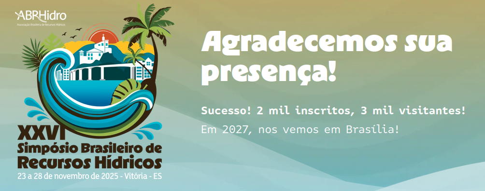
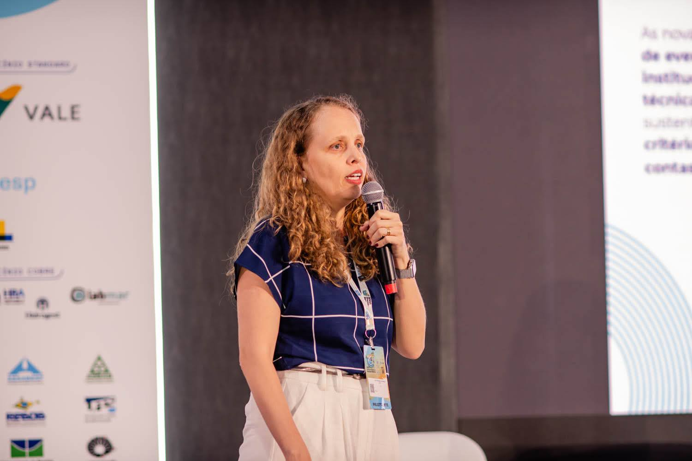
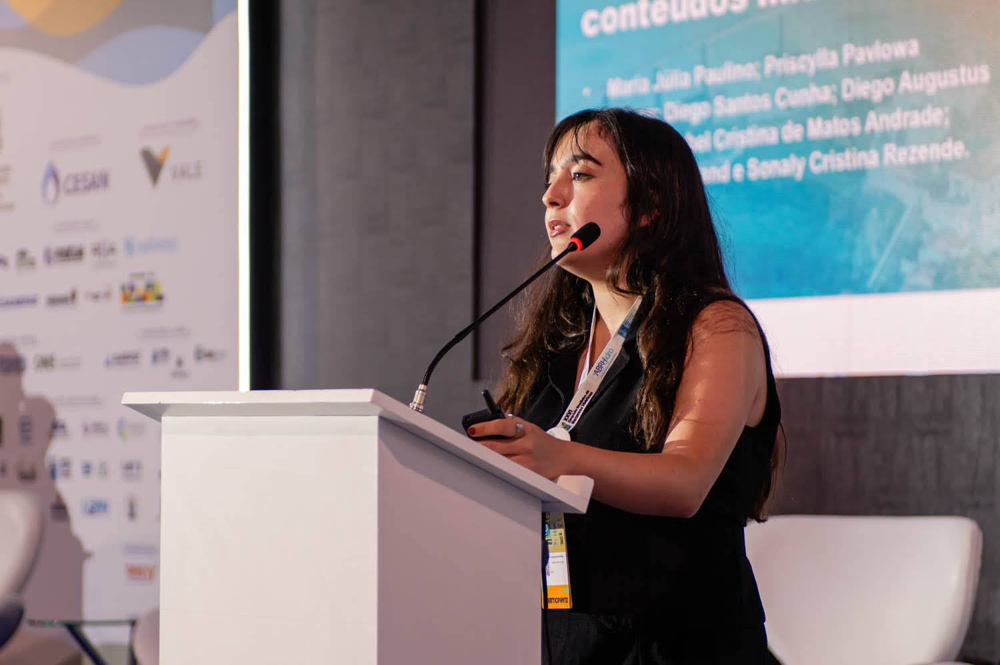
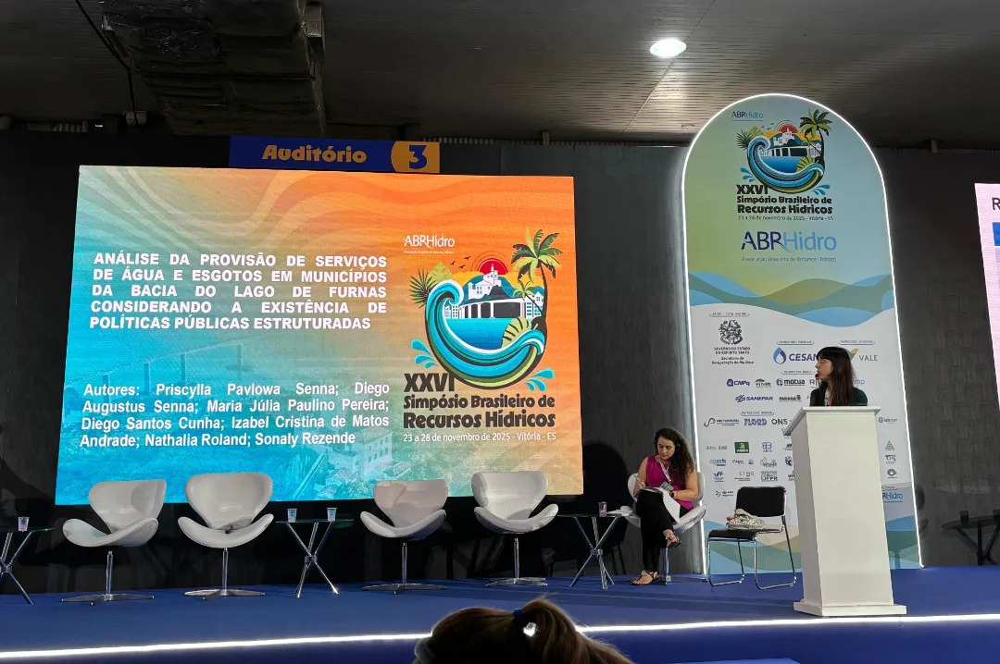
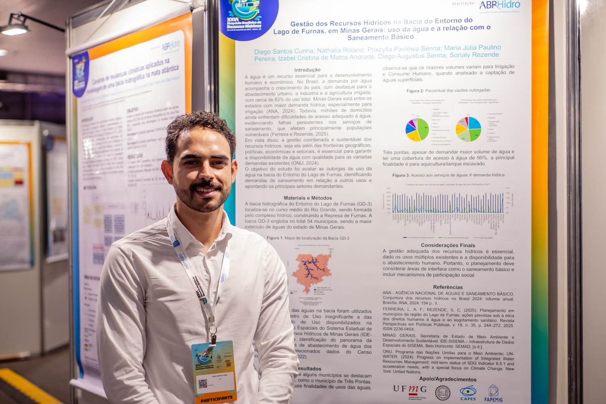

Realizado entre os dias 23 e 28 de novembro de 2025, no Pavilhão de Carapina, na grande Vitória (ES), o **XXVI Simpósio Brasileiro de Recursos Hídricos** reuniu pesquisadores, estudantes e profissionais para discutir avanços científicos, tecnológicos e institucionais na gestão das águas no Brasil. Os alunos do Projeto Mar de Nós, realizado pela UFMG em parceria com a ALAGO, UNELAGOS e a FECITUR, apresentaram trabalhos científicos baseados em estudos sobre o Lago de Furnas nesse simpósio promovido pela Associação Brasileira de Recursos Hídricos.

Priscylla Pavlowa Senna, aluna de mestrado do PPG em Saneamento, Meio Ambiente e Recursos Hídricos da UFMG, apresentou o trabalho **Análise da Provisão de Serviços de Água e Esgotos em Municípios da Bacia do Lago de Furnas Considerando a Existência de Políticas Públicas Estruturadas.** Foi realizada a análise da adequação dos serviços de saneamento nos municípios e da existência de Planos Diretores e Planos Municipais de Saneamento Básico.

Foi apresentado, pela aluna de I.C. Maria Júlia Paulino, o trabalho **Conflito e Mobilização na Bacia do Lago de Furnas: Uma Interpretação Midiatica**, visando discutir as consequências da alteração no nível do reservatório e as mobilizações para conquistar a cota 762. 

A professora Talita Silva foi responsável pela apresentação **ÁGUAPLAY: gamificação como estratégia extensionista na formação em engenharia ambiental**, explorando o uso de ferramentas lúdicas como forma de ampliar o engajamento e a formação crítica de estudantes.

Diego Cunha, aluno de mestrado do PPG SMARH da UFMG, apresentou o trabalho **Gestão dos Recursos Hídricos na Bacia do Entorno do Lago de Furnas, em Minas Gerais: uso da água e a relação com o Saneamento Básico**. O objetivo do trabalho foi avaliar a demanda de água e os usos múltiplos dos municípios na bacia e correlacionar com a demanda do saneamento básico.

O projeto foi viabilizado com emendas parlamentares dos Deputados Odair Cunha e Professor Cleiton e com apoio das entidades parceiras.

Todos os trabalhos completos podem ser acessados [aqui](https://anais.abrhidro.org.br/jobs.php?Event=248).

::: {style="width: 100%; margin: 0 auto;"}
::: {layout-ncol=2}

Apresentações do Mar de Nós no XXVI SBRH

:::
:::

A presença do grupo no simpósio reforça o compromisso com a produção de conhecimento interdisciplinar e socialmente engajado, contribuindo para o avanço do debate sobre recursos hídricos no Brasil. Ao articular pesquisa, extensão e análise crítica, os trabalhos apresentados evidenciam a importância de compreender a água não apenas como recurso natural, mas como elemento central em disputas, políticas e processos de transformação social.

Mais informações sobre o evento podem ser encontradas em:
<https://eventos.abrhidro.org.br/xxvisbrh/>

<iframe src="https://www.instagram.com/p/DR5SZIJD3aD/embed"
        width="80%" height="580" frameborder="0" scrolling="no"></iframe>

