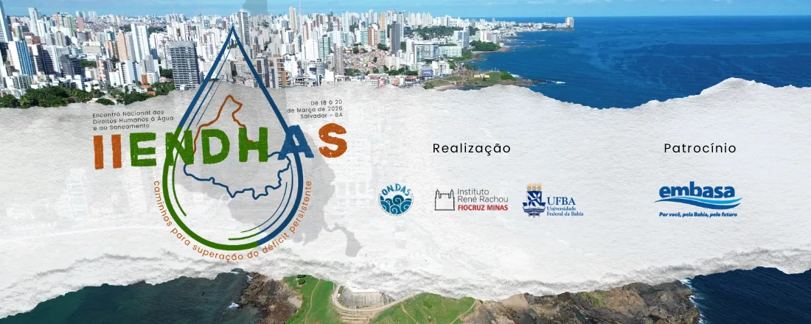
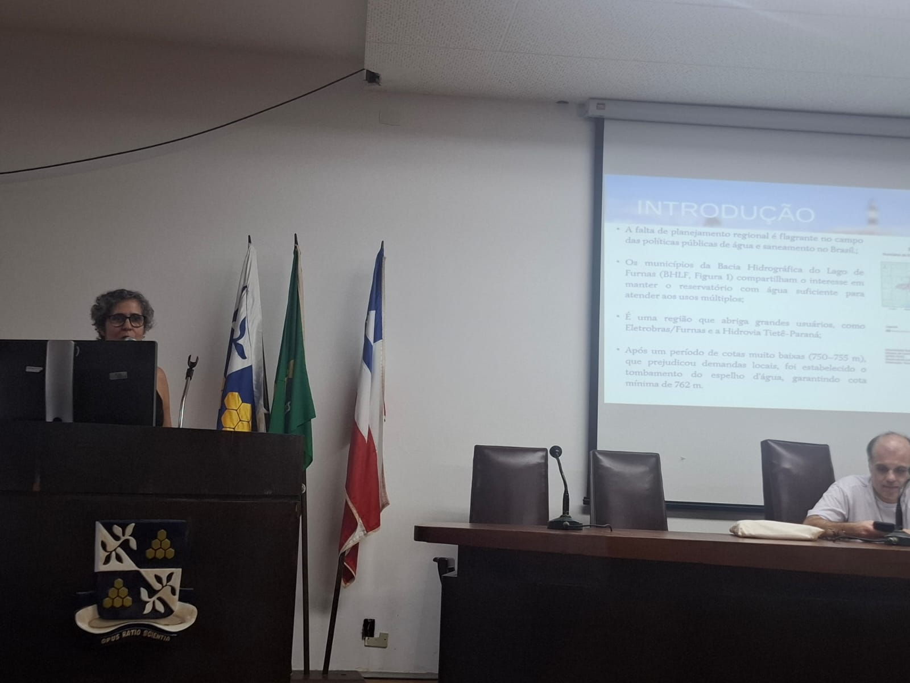
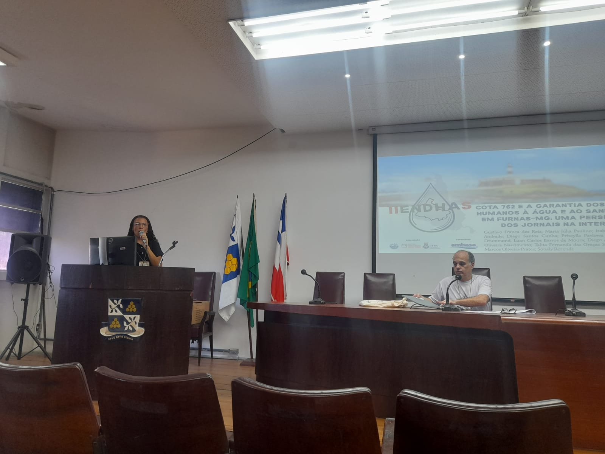

O grupo de pesquisa **Mar de Nós** participou do *II Encontro Nacional dos Direitos Humanos à Água e ao Saneamento (II ENDHAS)*, realizado entre os dias 18 e 20 de março de 2026, na Escola Politécnica da UFBA, em Salvador (Bahia).
O evento reuniu pesquisadores, movimentos sociais, profissionais do setor e diferentes atores comprometidos com a construção de políticas públicas sobre o acesso à água e ao saneamento no Brasil.

Ao longo dos três dias, o encontro se consolidou como um espaço plural de diálogo entre saberes técnicos, acadêmicos e populares. Temas centrais como racismo ambiental, desigualdades regionais, saneamento em territórios tradicionais, mudanças climáticas e gestão comunitária da água atravessaram as discussões, sempre com ênfase nas múltiplas dimensões de vulnerabilidade que impactam o acesso a serviços essenciais.

Nesse contexto, o grupo Mar de Nós contribuiu com a apresentação de trabalhos na sessão da tarde do dia 19 de março, abordando questões relevantes relacionadas à bacia hidrográfica do Lago de Furnas. As pesquisas apresentadas exploraram, de forma integrada, aspectos de desempenho dos serviços de água e esgoto, sustentabilidade econômica e universalização do acesso, além de análises sobre o papel da mídia na construção do debate público em torno da cota 762 e dos direitos humanos à água e ao saneamento na região.

::: {style="width: 90%; margin: 0 auto;"}
::: {layout-ncol=2}

Apresentações do Mar de Nós no II ENDHAS

:::
:::

Os trabalhos apresentados foram desenvolvidos por uma equipe ampla e interdisciplinar, refletindo o caráter colaborativo do grupo e sua articulação com diferentes instituições e territórios. Essa diversidade de olhares foi essencial para compreender a complexidade dos desafios enfrentados na região de Furnas, especialmente no que diz respeito às tensões entre usos da água, governança e garantia de direitos.

A participação no II ENDHAS também reforçou a importância de aproximar a produção acadêmica das demandas sociais concretas. Ao dialogar com movimentos e organizações da sociedade civil, o grupo ampliou as possibilidades de impacto de suas pesquisas, contribuindo para a construção de soluções mais sensíveis às realidades locais.

Por fim, destacamos que os códigos utilizados nas análises apresentadas estão disponíveis publicamente, promovendo transparência e reprodutibilidade das pesquisas:

<https://github.com/mardenos-ufmg/IIENDHAS---2025>

A experiência no encontro reafirma o compromisso do Mar de Nós com a produção de conhecimento crítico e engajado, voltado à promoção dos direitos humanos e à construção de caminhos para a superação das desigualdades no acesso à água e ao saneamento no Brasil.
