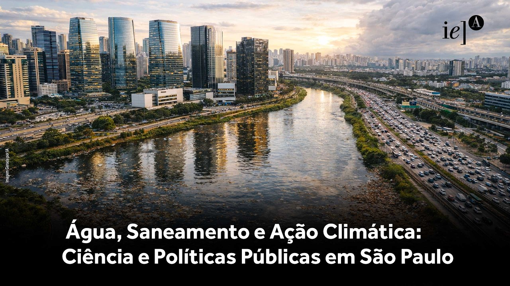
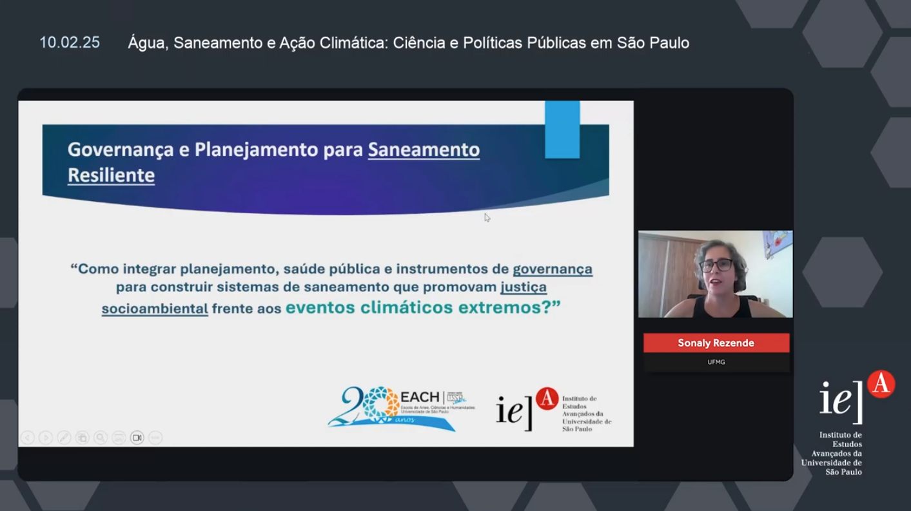

Realizado em 10 de fevereiro de 2026, na Sala Alfredo Bosi da Cidade Universitária, em São Paulo, o encontro “Água, Saneamento e Ação Climática: Ciência e Políticas Públicas em São Paulo” reuniu especialistas, gestores públicos e representantes da sociedade civil para debater estratégias de adaptação às mudanças climáticas no setor. Ao longo do dia, foram discutidos os desafios e as oportunidades para fortalecer a resiliência dos serviços de saneamento, com foco na integração entre ciência, planejamento e políticas públicas em um cenário de crescente pressão sobre os recursos hídricos. O evento foi organizado pelo [Instituto de Estudos Avançados (IEA-USP)](https://www.iea.usp.br/eventos/agua-saneamento-acao-climatica).

Um dos marcos do encontro foi o lançamento oficial do **Centro de Ciência para o Desenvolvimento em Saneamento e Resiliência Climática (CCD Saneaclima)**, iniciativa apoiada pela FAPESP e voltada à produção de pesquisa aplicada e à cooperação entre instituições. O centro surge com o objetivo de responder a problemas estratégicos do saneamento, articulando ciência e política pública em um cenário de crescente complexidade ambiental.

A programação incluiu duas mesas principais de debate. Na mesa “Governança e Planejamento para Saneamento Resiliente”, foram discutidos os desafios institucionais para a construção de sistemas capazes de responder de forma eficaz aos eventos climáticos extremos. Representando o grupo Mar de Nós, **Sonaly Rezende (UFMG)** participou como debatedora, contribuindo remotamente para a reflexão sobre integração entre planejamento, saúde pública e instrumentos de governança.

A discussão foi orientada por uma questão central: como construir sistemas de saneamento que, além de tecnicamente eficientes, promovam justiça socioambiental? As falas destacaram a necessidade de superar abordagens fragmentadas, incorporando perspectivas interdisciplinares e reconhecendo as desigualdades estruturais que marcam o acesso à água e ao saneamento no Brasil.

Mesmo com participação presencial limitada, o evento contou com [transmissão online](https://youtu.be/J_bTCWAnSc4&t=10240), ampliando o alcance das discussões e reforçando a importância de espaços como esse para a construção coletiva de conhecimento e políticas públicas mais robustas.
